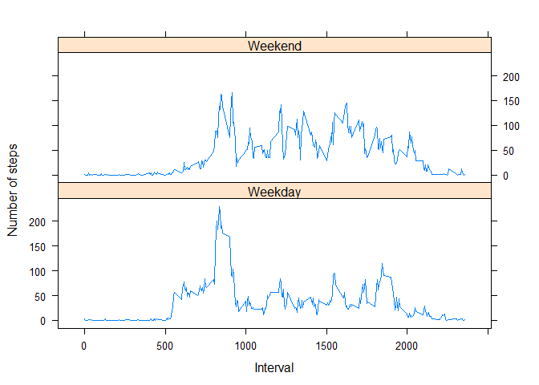

## Loading and preprocessing the data
*Loading the .csv file.

```r
unzip("activity.zip")
dataset <- read.csv("activity.csv")
summary(dataset)
```

```
##      steps            date              interval     
##  Min.   :  0.00   Length:17568       Min.   :   0.0  
##  1st Qu.:  0.00   Class :character   1st Qu.: 588.8  
##  Median :  0.00   Mode  :character   Median :1177.5  
##  Mean   : 37.38                      Mean   :1177.5  
##  3rd Qu.: 12.00                      3rd Qu.:1766.2  
##  Max.   :806.00                      Max.   :2355.0  
##  NA's   :2304
```


## What is mean total number of steps taken per day?
*Total number of steps taken each day.

```r
stepsPerDay <- aggregate(steps ~ date, dataset, sum, na.rm = TRUE)
```
*The corresponding Histogram.

```r
hist(stepsPerDay$steps)
```

<!-- -->
*Mean and median of the total number of steps taken per day.

```r
meanSteps <- mean(stepsPerDay$steps)
medianSteps <- median(stepsPerDay$steps)
```


## What is the average daily activity pattern?
*Average Number of steps taken and corresponding Time series plot(type='l').

```r
stepsPerInterval <- aggregate(steps ~ interval, dataset, mean, na.rm = TRUE);
plot(stepsPerInterval$interval, stepsPerInterval$steps, type = 'l');
```

<!-- -->

*The 5-minute interval that corresponds to the maximum(average) number steps.

```r
max5MinStepAvg <- max(stepsPerInterval$steps)
max5MinStepInterval <- stepsPerInterval[stepsPerInterval$steps == max5MinStepAvg, 1];
```

## Imputing missing values
*Total number of missing values in the dataset

```r
NAs <- sum(is.na(dataset$steps))
```
*The strategy used here is that, mean values corresponding to the intervals(where
 value is missing in original dataset) is taken from the stepsPerInterval variable computed earlier and replaced with NAs. A new dataset is created.


```r
imputedDataset <- dataset
for(i in 1:nrow(imputedDataset)){
        if(is.na(imputedDataset$steps[i])){
                imputedDataset$steps[i] <- stepsPerInterval$steps[stepsPerInterval$interval == imputedDataset$interval[i]]
        }
}
```
*Calculating total number of steps per day, mean and median for new dataset.

```r
stepsPerDayImputed <- aggregate(steps ~ date, imputedDataset, sum);
hist(stepsPerDayImputed$steps)
```

<!-- -->

```r
meanStepsImputed <- mean(stepsPerDayImputed$steps);
medianStepsImputed <- median(stepsPerDayImputed$steps);
```

*There seems to be minimal difference in the mean and medians of the old and new dataset.

## Are there differences in activity patterns between weekdays and weekends?
*A new factor variable introduced in the dataset with two levels – “weekday” and “weekend” indicating whether a given date is a weekday or weekend day.

```r
imputedDataset$date <- as.Date(imputedDataset$date, format="%Y-%m-%d");
imputedDataset$day <- weekdays(imputedDataset$date)
```
*Panel plot containing a time series plot (i.e. 𝚝𝚢𝚙𝚎 = “𝚕”) of the 5-minute interval (x-axis) and the average number of steps taken, averaged across all weekday days or weekend days (y-axis).

```r
for(i in 1:nrow(imputedDataset)){
        if(imputedDataset$day[i] == "Saturday" || imputedDataset$day[i] == "Sunday"){
                imputedDataset$day[i] <- "Weekend";
        }
        else{
                imputedDataset$day[i] <- "Weekday";
        }
}

stepsPerDay2 <- aggregate(steps ~ interval + day, imputedDataset, mean);
library(lattice)
xyplot(steps ~ interval | day, stepsPerDay2, type = "l", layout = c(1, 2), xlab = "Interval", ylab = "Number of steps")
```

<!-- -->

